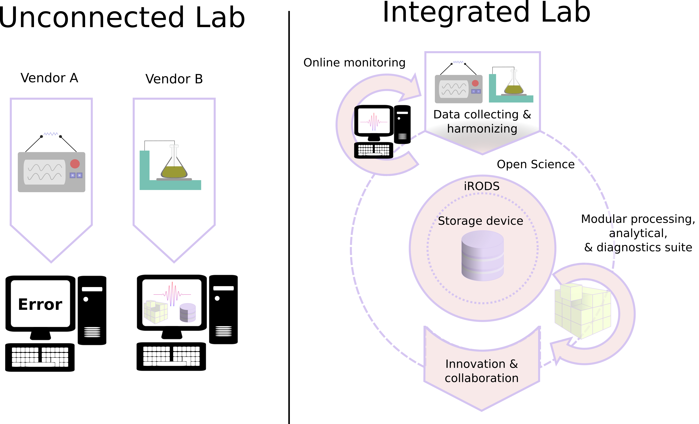

 
 

 

## The problem

Data management and subsequent downstream recycling of data is a primer for future innovation. Solutions for better data management infrastructures, such as formalized in the FAIR data guiding principles, are not yet implemented in laboratories populated by a range of analytical instruments. Each of these machines often has their own vendor supplied software suite for data processing and diagnostics, and thus prevents transparency of these workflows. This so-called "vendor lock-in" further results in various data models which are not easily integrated. We want to develop a more universal solution for analytical data collection and harmonization in laboratories.

### The integrated lab

The integrated lab is a solution to centralize data management of the traditional unconnected lab by collecting and harmonizing data streams from various lab instruments (software package 1), and by providing open-sourced alternatives for routine analytical workflows. These routine analytics are now often locked away in a plethora of vendor supplied software suits. Because of our background in Earth sciences, this idea "the integrated lab" will, as an initial step, focus on observational data from (geo)chemical laboratory facilities.

**Software package 1: Portable ANalytical data Aggregation and Coordination for database Entry and Access (PANACEA)**

A first step in the realisation of an integrated lab would encompass a solution for collecting and harmonising data streams from various lab instruments. This harmonisation encompasses parsing of unstructured (meta)data formats in a rectangular format—notably, separating variables, units, and values, and by adhering to SQL-like data normalization principles. This solution would therefore make analytical data more easily accessible for both humans and machines. In extension we intend that this solution centralizes data
management of labs by facilitating automatic data ingest (i.e., data import) as a subsystem of iRODS (Integrated Rule-Oriented Data System). Besides addressing the vendor lock-in of analytical data and optimized data management solutions, this tool has several other benefits:

-   New software updates of the vendor-supplied software that impact the output format can be more easily accommodated, and do not require cumbersome updates of custom, standalone solutions.
-   Data formats from defunct software and vendors can be more conveniently analysed and/or archived in a central data management
system.
-   The integration of (meta)data from various sources can aid online monitoring of lab performance.

We envision three viable solutions, which require varying degrees of human intervention:

1. A mechanism to aid the location of variables based on user input.
2. A human-crafted (and adaptable) rule-based system.
3. A natural language processing approach involving self-supervised machine learning.

The first approach would require considerable knowledge of the end-user considering the raw data and its internal organization. Whereas the other two approaches entail text normalization through tokenization and would be freer of human intervention but would therefore also constitute a riskier undertaking. We propose encoding the solution in the C++ language to support portability with R and Python and ensure optimal performance with large datasets.

